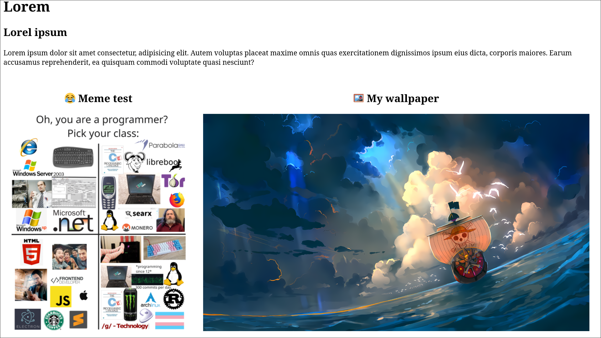
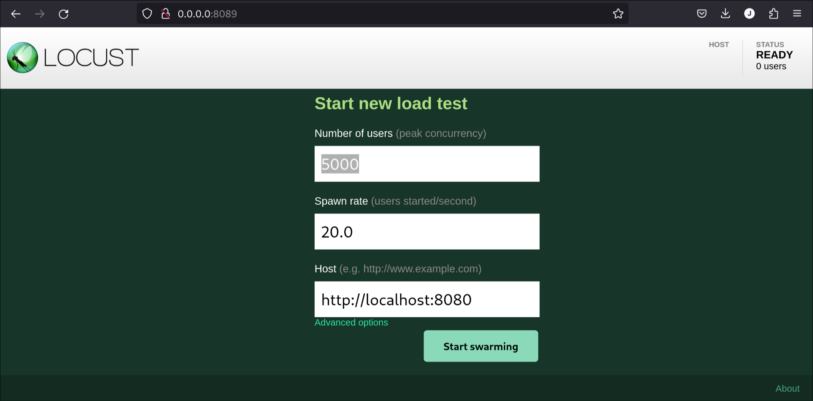
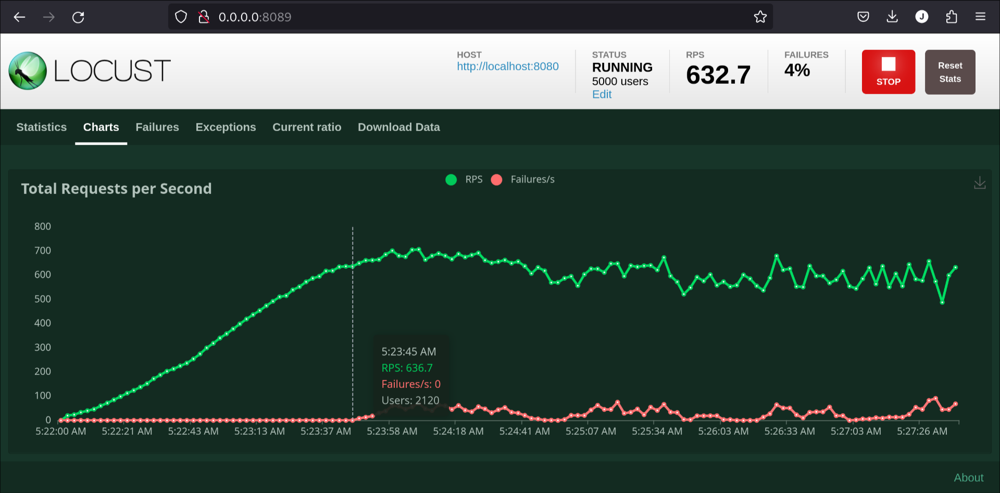

# Blue Dragon

This is a minimal web framework from scratch made in C++,
for learning porpuses.

## ✅ Features

- [x] HTTP/1.1 support.
- [x] `GET` support.
- [x] `HEAD` support.
- [ ] `POST` support.
- [x] `200` status code response.
- [ ] `400` status code response.
    - [x] In some areas.
- [x] `404` status code response.
- [x] Concurrency support.
- [x] Logging support.
    - [ ] could be improved adding colors.
- [ ] Command line support.
- [x] Endpoints testing with `curl`.
    - [x] `curl -i http://127.0.0.1:8080/public/index.html`
    - [x] `curl -I http://127.0.0.1:8080/public/index.html`
    - [x] `curl -X POST -H "Content-Type: application/json" -d '{"name": "Juan"}' http://127.0.0.1:8080/api/name`
- [x] Getting files/resources:
    - [x] Webpage with `HTML` and an image.
    - [x] Webpage with `HTML` and multiple images.
    - [x] Webpage with a file with at least 1MB in size.
    - [x] Webpage with multiple files with at least 1MB in size.
- [ ] Documentation.
    - [x] Basic `README.md` documentation.
    - [ ] `LaTex` documentation.
- [x] Load testing support.
- [ ] AWS deploy.
- [ ] `Docker` support.
- [ ] `CMake` support.
- [ ] `C++` code best practices.

## 📦 Compile

### 📤 Dependencies
You need to go to download the [`nlohmann/json releases GitHub page`](https://github.com/nlohmann/json/releases) and download the `json.hpp`. Then copy the `json.hpp` where the `blue_dragon.cpp` file is.

### ▶️ Run

If you are in a linux environment you can run:

```bash
# Run either
./build.sh
# or manually run
g++ -pthread -std=c++17 -O3 -o webserver blue_dragon.cpp
```

Then you can go to [http://localhost:8080/public/index.html](http://localhost:8080/public/index.html) and you will see something like this:



## 🧪 Testing

### 🌡️ Load Testing

We are gonna use [`locust`](https://locust.io/) to test out our endpoints
and measure how well the server manage threads.

To install the dependencies just run:

```bash
pip install locust
```

And to run our *tests* go the `testing` folder and run:

```bash
# Run either
./loadtesting.sh
# or manually run
locust -f locust.py --host http://localhost:8080 --users 5000 --spawn-rate 20
```

You will see a dashboard like this:




## 📁 Public

This folder contains all the public assets for the web server to
*"serve"*.

## 🥼 Experimentations

This folder contains some internal tests to try out how to work
from scratch with sockets and make a web server from *zero (0)*.
